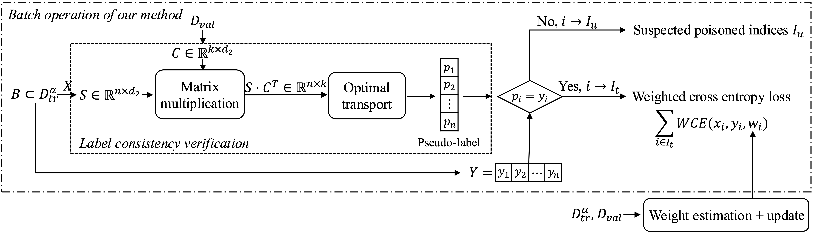
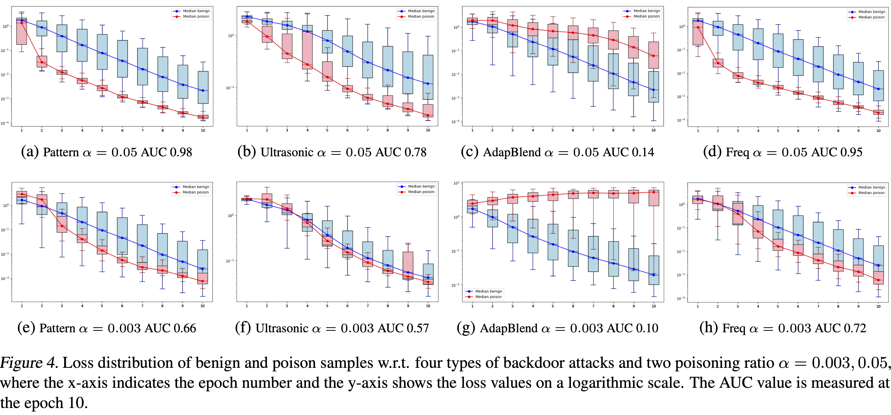

# Prototype-Guided Robust Learning against Backdoor Attack
Training a benign model from a dataset poisoned by backdoor attacks is a challenging task. Existing works rely on various assumptions, and only defend against specific types of backdoor attacks. In this paper, we propose _Prototype-Guided Robust Learning (PGRL)_, a more robust defence against diverse backdoor attacks. Specifically, leveraging a tiny set of benign samples, PGRL generates prototype vectors to guide the training process. 
We implement seven existing defences and compare them with our PGRL across four types of backdoor attacks. Empirical results show that PGRL outperforms existing methods with a better robustness. Furthermore, to address a more realistic scenario, we analyse PGRL’s performance against an adaptive attack, where the attacker is assumed to have full knowledge on PGRL’s mechanism, highlighting its strengths and limitations in practical settings.


# Methodology overview

The overview of PGRL is shown in the previous picture, which consists of: 
1) _Label consistency verification_: exploiting the prototypes to predict pseudo-labels for all training samples, and verifying whether the pseudo-labels are consistent with the labels presented in the dataset; 
2) _Weighted cross entropy_: utilising the label-consistent samples (as trusted data) for model training via a customised weighted cross-entropy loss function, where the weights are determined by analysing the feature distribution of the entire training dataset. 

Note, the label consistency verification is conducted online for each batch to enable real-time updates, while the weight estimation is performed offline every five epochs, allowing analysis of the entire training dataset's features to ensure precision.


# Environment installation
To create and activate the environment, follow these steps:
   ```bash
   conda env create -f environment.yml
   conda activate PGRL
   ```
Download the pre-trained poison generator from [google driver](https://drive.google.com/file/d/1I8-kCcos1wySpEkfck4WTDuCEiNMopXt/view?usp=drive_link) and unzip it in this subfolder `poisonDataset/blto`.
# Dataset preparation
To generate the benign and poisoned datasets, run:
   ```bash
   chmod u+x create_dataset.sh
   ./create_dataset.sh
   ```
The creation code for Pattern, Ultrasonic, AdapBlend, Freq, and our adaptive attack are located in the following subfolders 
`poisonDataset/pattern`, `poisonDataset/ultrasonic`, `poisonDataset/adaptivecifar10`, `poisonDataset/freq_meg_500`, and
`poisonDataset/blto`, respectively. After running, you can find the benign and poisoned training and test datasets in
these corresponding subfolders.


# Backdoor performance
To evaluate the backdoor performance, run:
   ```bash
   chmod u+x backdoor_performance.sh
   ./backdoor_performance.sh
   ```
The `backdoor_performance.sh` first trains models from poisoned datasets infected by Pattern, Ultrasonic, AdapBlend, Freq, and our adaptive attack.
Then, train the models from clean datasets, in order to prove that the backdoor will not reduce the model's normal performance.

# PGRL performance
To evaluate our PGRL performance, run:
   ```bash
   chmod u+x pgrl_performance.sh
   ./pgrl_performance.sh
   ```
The `pgrl_performance.sh` trains a benign model from poisoned dataset infected by Pattern, Ultrasonic, AdapBlend, Freq, 
and our adaptive attack with poison ratio 0.003 and 0.05.


# Priority degree

To reproduce the previous pictures, run:
   ```bash
   chmod u+x priority_degree.sh
   ./priority_degree.sh
   ```
The `priority_degree.sh` trains a model for 10 epochs over the poisoned data infected by different attacks, plots the
boxplot of loss distributions, and calculates the AUC at 10-th epoch. If you want to use local gradient ascent instead 
of normal cross-entropy loss, please add `-trap True` at the end of the command.

# Ablation study
To do the ablation study, run:
   ```bash
   chmod u+x ablation_study.sh
   ./ablation_study.sh
   ```
The `ablation_study.sh` checks the influence of Optimal Transport (OT), number of validate dataset $|D_{val}|$, 
threshold for weight normalisation $\tau$, and number of data augmentation $n_{aug}$ to the PGRL performance 
against the Pattern attack with poisoning ratio 0.05

